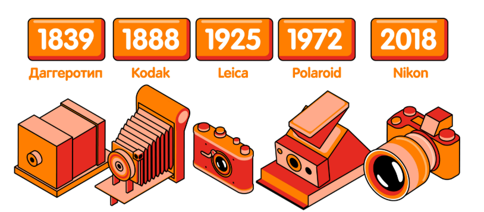

# Эволюция фотоаппаратов  

## Введение  
Фотоаппараты прошли долгий путь развития — от простых коробок с линзой до современных смартфонов с несколькими камерами.  

## Основные этапы  

### 1. Ранние фотоаппараты (XIX век)  
- Камера-обскура как прообраз фотоаппарата  
- Дагеротип — первый способ получения фотографии  
- Долгие экспозиции и громоздкие устройства  

### 2. Плёночные фотоаппараты (XX век)  
- Изобретение фотоплёнки Джорджем Истменом (Kodak)  
- Распространение компактных камер для массового использования  
- Появление зеркальных фотоаппаратов (SLR)  

### 3. Цифровая революция (1990–2000-е годы)  
- Первые цифровые камеры  
- Распространение карт памяти вместо плёнки  
- Доступность цифровой фотографии для каждого  

### 4. Современная эпоха  
- Смартфоны с несколькими камерами  
- Развитие профессиональных беззеркальных камер  
- Искусственный интеллект и обработка фото  

## Заключение  
Фотоаппараты продолжают совершенствоваться, делая фотографию доступной каждому и превращая её в неотъемлемую часть повседневной жизни.  

